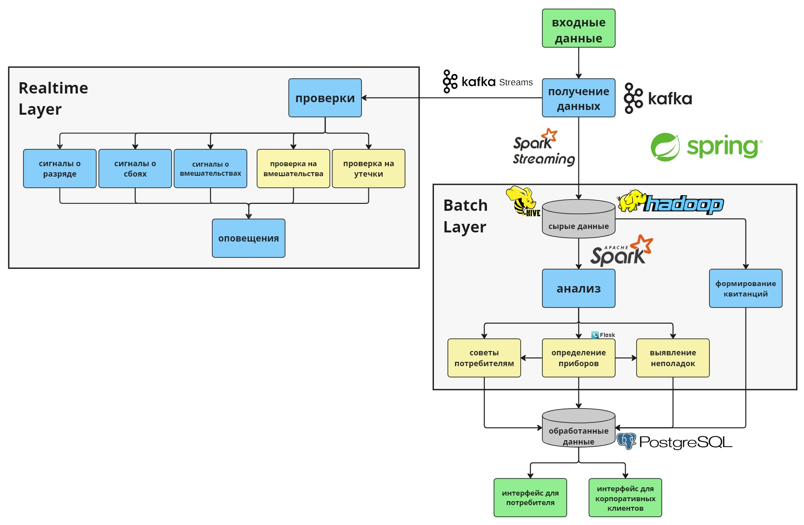

В данном репозитории представлена реализация прототипа цифровой платформы асинхронной сенсорной системы дистанционного мониторинга ресурсопотребления домохозяйств, являющаяся частью магистерской диссертации. Платформа построена на базе лямбда-архитектуры и использует такие инструменты для работы с большими данными, как Hadoop, Hive, Spark и Kafka.

[Полный текст работы](текст%20работы/магистерская диссертация.pdf)

[Статья, посвящённая архитектуре платформы](текст%20работы/статья)

[Репозиторий с реализацией и результатами экспериментов](https://github.com/FilippovIvan19/master_paper_statistical_experiments), поставленных с целью выявления более подходящего формата входного потока данных для платформы, также являющимися частью магистерской диссертации

Архитектура платформы представлена на схеме ниже

